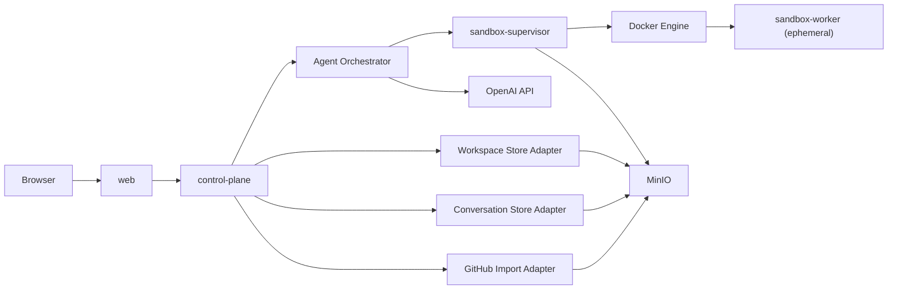

# Local-First Implementation Roadmap

## Purpose

This document defines the first implementation step for the code-analysis SaaS platform:

- validate the core capabilities locally
- avoid early AWS deployment complexity
- keep the architecture aligned with the later AWS target state
- use S3-compatible storage as the canonical persistence layer from day one

The initial focus is on four core subsystems:

- Workspace Store
- Agent Orchestrator
- Sandbox Pool
- Conversation Store

The design target is a local developer stack that can:

1. import a GitHub repository
2. snapshot it into object storage
3. materialize that snapshot into an isolated sandbox
4. run an OpenAI-based analysis workflow over the code
5. stream an answer back to the web client
6. persist conversation and run history

## Recommendation


For the first implementation step, the system should be built as a small local control plane plus disposable sandbox workers. The system should use an S3-compatible object store such as MinIO as the canonical persistence layer for:

- workspace snapshots
- sandbox session state
- conversation events
- run events
- generated artifacts

This is a better exploration path than trying to emulate a full AWS deployment locally. It preserves the important architectural boundaries without introducing unnecessary platform work.

## Design Principles

- Keep the control plane and sandbox compute plane separate.
- Treat S3 as the system of record for immutable data and append-only event logs.
- Keep workspace snapshots immutable.
- Keep one logical writer per aggregate:
  - conversation
  - run
  - sandbox session
- Make every answer evidence-backed with file and line citations.
- Prefer restartable, reconstructable flows over in-memory state.
- Keep the first local build to a few deployables, not many microservices.

## Scope of the First Vertical Slice

The first vertical slice must support one end-to-end scenario:

1. import one GitHub repository
2. create one workspace snapshot in object storage
3. create one conversation
4. ask one question about the codebase
5. launch one sandbox worker from Docker
6. return one grounded answer with citations
7. persist all resulting conversation and run data

Out of scope for the first slice:

- multi-tenant billing
- production-grade authentication
- ticket system integrations
- background scheduling
- complex branch management
- collaborative editing
- semantic indexing beyond minimal metadata

## Physical Architecture

### Local deployables

- `web`
  - browser UI
  - simple chat and workspace selection
- `control-plane`
  - public API
  - agent orchestration
  - conversation persistence adapter
  - workspace persistence adapter
  - GitHub import adapter
- `sandbox-supervisor`
  - provisions, resumes, and disposes sandbox workers
  - manages Docker lifecycle
- `minio`
  - S3-compatible object storage

### Ephemeral runtime elements

- `sandbox-worker`
  - started per analysis run or reused per conversation
  - receives a workspace snapshot reference
  - expands repo contents into a local workspace
  - executes the OpenAI agent workflow
  - writes artifacts and session state back to object storage

### Local physical topology



## Logical Component Model

### 1. Workspace Store

Responsibilities:

- import repositories from GitHub
- create immutable workspace snapshots
- store snapshot manifests and extracted metadata
- provide snapshot references to sandbox workers
- persist generated workspace artifacts

Owns:

- workspace identifiers
- snapshot identifiers
- repository source metadata
- object keys for repo archives and manifests

Does not own:

- conversation state
- model run state
- user identity

### 2. Conversation Store

Responsibilities:

- persist conversation history
- persist run-to-conversation linkage
- store approvals and final answers
- expose append-only conversation events
- maintain materialized conversation head state

Owns:

- conversation identifiers
- message identifiers
- event sequence ordering
- run linkage

Does not own:

- workspace contents
- sandbox filesystem state

### 3. Agent Orchestrator

Responsibilities:

- receive the user question
- resolve the active workspace snapshot
- decide whether to create or resume a sandbox session
- invoke the OpenAI Agents SDK workflow
- stream run events to the caller
- persist final answer, citations, and artifacts
- manage approval pauses and resumptions

Owns:

- run identifiers
- orchestration policy
- model and tool selection
- answer envelope assembly

Does not own:

- repository cloning
- long-term object persistence primitives
- Docker lifecycle directly

### 4. Sandbox Pool

Responsibilities:

- create sandbox worker containers
- mount or download workspace snapshots
- resume from stored session state when requested
- expose a stable runtime contract to the orchestrator
- persist sandbox state and output artifacts

Owns:

- sandbox session identifiers
- worker lifecycle state
- sandbox runtime image selection

Does not own:

- external API concerns
- conversation history

## Deployable Boundaries for the First Build

The first build should not split each logical component into its own deployable.

Recommended deployable mapping:

- `web`
- `control-plane`
  - includes Workspace Store adapter
  - includes Conversation Store adapter
  - includes Agent Orchestrator
  - includes GitHub import adapter
- `sandbox-supervisor`
- `minio`

This keeps the runtime simple while preserving the interfaces needed for later extraction into separate services.

## Interface Contracts

## External API Contracts

### Create workspace import

`POST /v1/workspaces/imports/github`

Request:

```json
{
  "tenant_id": "tenant_local",
  "repo_url": "https://github.com/acme/example-repo.git",
  "ref": "main",
  "github_credential_ref": "local-dev-token"
}
```

Response:

```json
{
  "workspace_id": "ws_01",
  "snapshot_id": "snap_01",
  "source_commit": "abc123def456",
  "status": "READY"
}
```

### Create conversation

`POST /v1/conversations`

Request:

```json
{
  "tenant_id": "tenant_local",
  "workspace_id": "ws_01",
  "title": "Example repo analysis"
}
```

Response:

```json
{
  "conversation_id": "conv_01",
  "status": "OPEN"
}
```

### Ask a question

`POST /v1/conversations/{conversation_id}/questions`

Request:

```json
{
  "message": "How is authentication implemented in this codebase?",
  "workspace_snapshot_id": "snap_01",
  "resume_sandbox": true
}
```

Response:

```json
{
  "run_id": "run_01",
  "status": "STARTED",
  "events_url": "/v1/runs/run_01/events"
}
```

### Stream run events

`GET /v1/runs/{run_id}/events`

Server-sent events payload types:

- `run.started`
- `run.progress`
- `tool.started`
- `tool.completed`
- `citation.created`
- `approval.required`
- `answer.delta`
- `run.completed`
- `run.failed`

### Resolve approval

`POST /v1/runs/{run_id}/approvals/{approval_id}`

Request:

```json
{
  "decision": "approve",
  "reason": "Allow repo inspection only"
}
```

Response:

```json
{
  "run_id": "run_01",
  "approval_id": "apr_01",
  "status": "RESUMED"
}
```

## Internal Contracts

### WorkspaceSnapshotRef

```json
{
  "workspace_id": "ws_01",
  "snapshot_id": "snap_01",
  "repo_url": "https://github.com/acme/example-repo.git",
  "ref": "main",
  "commit_sha": "abc123def456",
  "archive_object_key": "tenants/tenant_local/workspaces/ws_01/snapshots/snap_01/repo.tar.zst",
  "manifest_object_key": "tenants/tenant_local/workspaces/ws_01/snapshots/snap_01/manifest.json",
  "created_at": "2026-04-23T18:00:00Z"
}
```

### SandboxSessionRef

```json
{
  "sandbox_id": "sbx_01",
  "provider": "docker",
  "runtime_image": "code-analyst/sandbox-worker:dev",
  "status": "RUNNING",
  "snapshot_id": "snap_01",
  "session_state_key": "tenants/tenant_local/sandboxes/sbx_01/session_state.json"
}
```

### ConversationEvent

```json
{
  "event_id": "evt_000001",
  "conversation_id": "conv_01",
  "run_id": "run_01",
  "sequence": 1,
  "type": "user.message.created",
  "payload": {
    "message": "How is authentication implemented in this codebase?"
  },
  "timestamp": "2026-04-23T18:05:00Z"
}
```

### EvidenceRef

```json
{
  "snapshot_id": "snap_01",
  "path": "src/auth/service.py",
  "start_line": 21,
  "end_line": 46,
  "excerpt_hash": "sha256:9c0c2f..."
}
```

### AnswerEnvelope

```json
{
  "answer_markdown": "Authentication is handled by a JWT middleware and a session refresh flow.",
  "citations": [
    {
      "snapshot_id": "snap_01",
      "path": "src/auth/service.py",
      "start_line": 21,
      "end_line": 46
    }
  ],
  "artifacts": [],
  "followups": [
    "Show the login request path",
    "List the token refresh failure cases"
  ]
}
```

## S3 Object Model

Object storage layout:

```text
tenants/{tenant_id}/
  workspaces/{workspace_id}/
    snapshots/{snapshot_id}/
      repo.tar.zst
      manifest.json
      metadata.json
  sandboxes/{sandbox_id}/
    session_state.json
    artifacts/{artifact_id}/...
    logs/{run_id}.jsonl
  conversations/{conversation_id}/
    head.json
    events/{sequence}.json
  runs/{run_id}/
    state.json
    events/{sequence}.json
    final-answer.json
```

Storage rules:

- workspace snapshots are immutable
- conversation events are append-only
- run events are append-only
- `head.json` and `state.json` are materialized views
- artifacts are immutable once written

## Persistence Strategy

### Workspace Store persistence

Persist:

- repo source metadata
- snapshot archive
- snapshot manifest
- optional extracted inventory:
  - file list
  - language summary
  - top-level module map

### Conversation Store persistence

Persist:

- user message events
- assistant response events
- tool and approval events
- final answer envelope
- conversation head projection

### Sandbox persistence

Persist:

- session state
- workspace memory artifacts
- run logs
- output files generated in the sandbox

Important rule:

The sandbox worker must treat object storage as the durable boundary. Local container filesystem is disposable.

## Sandbox Runtime Contract

The sandbox worker should expose a minimal contract to the sandbox supervisor.

### Create sandbox session

Input:

- `WorkspaceSnapshotRef`
- optional `SandboxSessionRef` for resume
- runtime image name
- environment profile

Output:

- `SandboxSessionRef`

### Execute analysis turn

Input:

- `sandbox_id`
- `conversation_id`
- `run_id`
- user message
- orchestrator policy payload

Output:

- streamed execution events
- final `AnswerEnvelope`
- updated session state

### Dispose sandbox session

Input:

- `sandbox_id`
- `persist_session_state=true|false`

Output:

- final lifecycle status

## Agent Orchestrator Design

The orchestrator should be implemented as one application service with three internal roles:

- `RunCoordinator`
  - validates input
  - creates run records
  - binds conversation, workspace, and sandbox state
- `AnalysisAgentAdapter`
  - wraps the OpenAI Agents SDK
  - configures model, tools, and sandbox behavior
- `AnswerAssembler`
  - converts raw agent output into the final `AnswerEnvelope`
  - normalizes citations
  - writes final answer and final events

### First workflow

1. read conversation head
2. append user question event
3. resolve active workspace snapshot
4. create or resume sandbox session
5. invoke analysis agent
6. stream events to client
7. assemble answer envelope
8. write run final state
9. append assistant message event
10. update conversation head

## Local Build Technology Recommendation

### Recommended stack

- `web`: Next.js or a minimal React app
- `control-plane`: Python with FastAPI
- `sandbox-supervisor`: Python service or module in the same repo
- `sandbox-worker`: Python container image
- `storage`: MinIO

### Why Python in the control plane

The OpenAI Agents SDK sandbox support is currently centered on Python examples and workflows. Using Python in the orchestrator and sandbox worker keeps the local spike close to the supported path and reduces integration friction.

## Docker Compose Topology

Target local topology:

```yaml
services:
  web:
    build: ./apps/web
    ports: ["3000:3000"]
    depends_on: [control-plane]

  control-plane:
    build: ./services/control-plane
    ports: ["8080:8080"]
    environment:
      S3_ENDPOINT: http://minio:9000
      S3_BUCKET: code-analyst-dev
      SANDBOX_SUPERVISOR_URL: http://sandbox-supervisor:8090
    depends_on: [minio, sandbox-supervisor]

  sandbox-supervisor:
    build: ./services/sandbox-supervisor
    ports: ["8090:8090"]
    volumes:
      - /var/run/docker.sock:/var/run/docker.sock
    environment:
      S3_ENDPOINT: http://minio:9000
      S3_BUCKET: code-analyst-dev
    depends_on: [minio]

  minio:
    image: minio/minio
    command: server /data --console-address ":9001"
    ports: ["9000:9000", "9001:9001"]
```

Note:

In the first iteration, the `sandbox-worker` containers are started dynamically by the supervisor and are not defined as static Compose services.

## Roadmap

## Phase 0: Contract pack

Deliverables:

- this architecture document
- initial OpenAPI definition
- initial JSON schemas or Pydantic models
- S3 key conventions

Exit criteria:

- all core identifiers and payloads are defined
- no unresolved ambiguity around ownership of workspace, conversation, run, or sandbox state

## Phase 1: Workspace Store

Deliverables:

- GitHub import endpoint
- repo clone and archive logic
- snapshot manifest generation
- object store upload flow

Exit criteria:

- repo import creates a stable immutable snapshot
- sandbox can reconstruct the filesystem from object storage

## Phase 2: Conversation Store

Deliverables:

- create conversation endpoint
- append event endpoint or internal API
- conversation head materialization
- run state persistence

Exit criteria:

- one conversation can be created and resumed
- one run can be fully reconstructed from object storage

## Phase 3: Sandbox Pool

Deliverables:

- sandbox supervisor API
- Docker-based worker provisioning
- snapshot download and extraction
- session state writeback

Exit criteria:

- one sandbox can start from a snapshot
- one sandbox can be resumed or recreated from stored state

## Phase 4: Agent Orchestrator

Deliverables:

- question endpoint
- run coordinator
- OpenAI agent invocation
- SSE event streaming
- answer assembly with citations

Exit criteria:

- a user can ask one codebase question and receive one grounded answer

## Phase 5: Hardening and extension

Deliverables:

- approval flow support
- richer evidence model
- better artifact handling
- optional repo metadata indexing

Exit criteria:

- the local stack is stable enough to justify AWS deployment planning

## Acceptance Criteria for the Local Spike

- a GitHub repo can be imported and snapshotted into MinIO
- a conversation can be created and resumed
- a sandbox worker can reconstruct the workspace from a snapshot
- the orchestrator can run one analysis turn through the sandbox
- the answer includes at least one file-and-line citation
- conversation and run state survive service restarts

## Risks and Mitigations

### Risk: S3-only metadata querying becomes awkward

Mitigation:

- use append-only event files and materialized head objects now
- add a metadata index store later only if required

### Risk: sandbox lifecycle complexity leaks into the control plane

Mitigation:

- isolate Docker lifecycle inside the sandbox supervisor
- keep the control plane dependent only on `SandboxSessionRef` contracts

### Risk: answers are not well grounded

Mitigation:

- require `EvidenceRef` on all non-trivial claims
- reject final answer assembly when evidence is missing

### Risk: local stack differs too much from later AWS topology

Mitigation:

- keep object storage, sandbox isolation, and service interfaces stable
- change only the infrastructure providers later

## Recommended Immediate Next Build Step

Implement Phase 1 and the minimum scaffolding for Phase 2 and Phase 3.

The next concrete work item should be:

1. scaffold `control-plane`
2. scaffold `sandbox-supervisor`
3. add `docker-compose.yml`
4. add MinIO bucket bootstrap
5. implement `POST /v1/workspaces/imports/github`
6. implement immutable workspace snapshot upload
7. define the Pydantic contract models used by all four core subsystems

This gives the project a real system backbone without committing too early to cloud deployment details.

## Decision Summary

The recommended local-first architecture is:

- S3-compatible object storage as the canonical persistence layer
- one control plane service for API, orchestration, and persistence adapters
- one sandbox supervisor service for Docker worker lifecycle
- disposable sandbox workers that reconstruct their filesystem from stored snapshots
- append-only conversations and runs with materialized head state

This is the right next step because it validates the system's hardest boundaries first:

- repo-to-workspace persistence
- run-to-sandbox execution
- answer grounding
- durable conversation history
